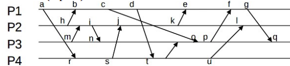

# homework-lamport-clock

Considere la Figura 1 donde se muestran cuatro procesos (i.e. P1, P2, P3 y P4), los eventos (e.g. a, b,c, ...) y los mensajes que los comunican. Todos los relojes estan inicializados en 0. Liste los valores de los relojes de Lamport (timestamps) mostrados en la Figura 1. Asuma que cada proceso maneja su timestamp como un entero simple. Proveea del valor del time stamp para cada evento.

 

Figura 1. Cuatro procesos P1,P2,P3,P4 ejecutan eventos a,b,c,d,.... para enviar y recibir mensajes.